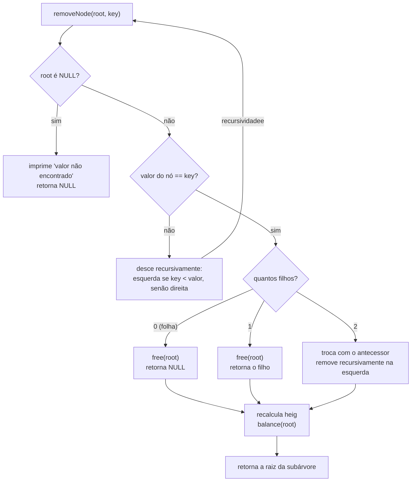

# Árvore AVL em C

Implementação de uma **árvore AVL** (árvore binária de busca auto-balanceada) em C, com inserção, remoção, rotações e impressão da árvore.

Esse código foi implementado e estudado para apresentação da **Avaliação I** da matéria **AED II** do curso Ciência da Computação, focado na função de remoção de um nó.

## Sumário

- [Como compilar e executar](#como-compilar-e-executar)
- [O que é uma AVL](#o-que-é-uma-avl)
- [Visão geral do código](#visão-geral-do-código)
- [Foco: a remoção de um nó](#foco-a-remoção-de-um-nó)
  - [Por que a recursão é natural aqui](#por-que-a-recursão-é-natural-aqui)
  - [Fluxo da função](#fluxo-da-função)
  - [Casos-base e casos recursivos](#casos-base-e-casos-recursivos)
  - [Ida e volta da recursão](#ida-e-volta-da-recursão)
  - [Os três casos de remoção](#os-três-casos-de-remoção)
  - [Rebalanceamento na volta](#rebalanceamento-na-volta)
- [Exemplo completo: removendo o 2](#exemplo-completo-removendo-o-2)
- [Exemplo com rotação após a remoção](#exemplo-com-rotação-após-a-remoção)
- [Complexidade](#complexidade)
- [Pontos de atenção e melhorias](#pontos-de-atenção-e-melhorias)

## Como compilar e executar

```bash
gcc avl2.c -o avl
./avl
```

## O que é uma AVL

Uma AVL é uma árvore binária de busca que mantém, em **todos** os nós, a diferença de altura entre as subárvores esquerda e direita em no máximo 1. Isso garante altura `O(log n)` e, portanto, busca, inserção e remoção em `O(log n)`, mesmo para entradas em ordem crescente (que degeneram uma BST comum em uma lista).

Definições usadas no código:

- **Altura** de `NULL` = `-1`; de uma folha = `0`; de um nó = `1 + max(altura esquerda, altura direita)`.
- **Fator de balanceamento** `fb = altura(esquerda) - altura(direita)`.
- Se `fb` chega a `+2` ou `-2`, o nó é corrigido com uma **rotação**.

## Visão geral do código

```c
typedef struct node {
    int value;
    struct node *left, *right;
    short heig;          // altura do nó, guardada para o fb custar O(1)
} Node;
```

| Função | O que faz |
|---|---|
| `newNode` | aloca um nó |
| `bigger` | maior de dois `short` |
| `heigNode` | altura de um nó (`-1` se for `NULL`) |
| `balancingFactor` | calcula `fb` de um nó |
| `leftRotation` / `rightRotation` | rotações simples |
| `leftRightRotation` / `rightLeftRotation` | rotações duplas |
| `balance` | decide qual rotação aplicar, se alguma |
| `insert` | insere recursivamente e rebalanceia na volta |
| `removeNode` | **remove recursivamente e rebalanceia na volta** |

### Como `balance` escolhe a rotação

| Situação | Rotação |
|---|---|
| `fb < -1` e `fb(direita) <= 0` | simples à esquerda |
| `fb > 1` e `fb(esquerda) >= 0` | simples à direita |
| `fb > 1` e `fb(esquerda) < 0` | dupla esquerda-direita |
| `fb < -1` e `fb(direita) > 0` | dupla direita-esquerda |

O `=` em `<= 0` e `>= 0` existe por causa da **remoção**: lá o filho pesado pode ter `fb = 0`, e nesse caso a rotação simples é a correta.

### Como as rotações recalculam alturas

Cada rotação atualiza a altura de `r` (que desceu) **antes** da de `y` (que subiu), porque a altura de `y` depende da de `r`:

```c
r->heig = bigger(heigNode(r->left), heigNode(r->right)) + 1;
y->heig = bigger(heigNode(y->left), heigNode(y->right)) + 1;
return y;   // nova raiz da subárvore
```

---

## Foco: a remoção de um nó

### Por que a recursão é natural aqui

Uma árvore é uma estrutura recursiva: cada subárvore é, ela própria, uma árvore. Isso torna a remoção simples de descrever:

> Para remover `key` da árvore com raiz `root`: se a raiz é a chave, remova-a; senão, remova `key` da subárvore esquerda ou direita, conforme a comparação.

A função devolve **a nova raiz da subárvore**, e quem chama religa o ponteiro:

```c
root->left = removeNode(root->left, key);
```

Esse retorno é essencial: a raiz de uma subárvore pode mudar durante a remoção (um filho sobe, ou uma rotação troca quem fica no topo). Reatribuir o resultado mantém a árvore consistente sem precisar de ponteiros para ponteiros nem de ponteiro para o pai.

### Fluxo da função



### Casos-base e casos recursivos

| Tipo | Situação | O que acontece |
|---|---|---|
| **Caso-base** | `root == NULL` | a chave não existe; retorna `NULL` |
| **Caso-base** | nó é a chave e é folha | `free` e retorna `NULL` |
| **Caso-base** | nó é a chave e tem 1 filho | `free` e retorna o filho |
| **Recursivo** | nó não é a chave | desce para esquerda ou direita |
| **Recursivo** | nó é a chave e tem 2 filhos | troca com o antecessor e chama `removeNode` na esquerda |

**A recursão sempre termina porque cada chamada recebe uma subárvore **estritamente menor** (um dos filhos), até cair em um caso-base.**

### Ida e volta da recursão

A recursão tem duas fases, e a segunda é a que faz a árvore continuar sendo AVL.

```
IDA (descendo)                       VOLTA (subindo)
──────────────                       ───────────────
removeNode(raiz)       ── chama ──►  recalcula heig, balance, retorna
  removeNode(filho)    ── chama ──►    recalcula heig, balance, retorna
    removeNode(neto)   ── chama ──►      acha a chave: remove, retorna
```

- **Ida**: a função desce comparando `key` com o valor de cada nó, como numa BST, até achar a chave ou chegar a `NULL`.
- **Volta**: cada chamada, ao receber o resultado da chamada filha, executa o final da função:

```c
root->heig = bigger(heigNode(root->left), heigNode(root->right)) + 1;
root = balance(root);
return root;
```

Assim, **todos os ancestrais do nó removido** têm a altura recalculada e são rebalanceados, do mais profundo até a raiz. Nenhum outro nó precisa ser conferido, porque só os nós desse caminho mudaram de altura.

### Os três casos de remoção

#### Caso 1: nó folha

```c
if(root->left == NULL && root->right == NULL){
    free(root);
    printf("elemento folha removido: %d !\n", key);
    return NULL;
}
```

Libera o nó e devolve `NULL`. O pai, que fez `root->left = removeNode(...)`, passa a ter `NULL` ali.

```
   5                5
  / \      ──►       \
 3   8                8        (remover 3)
```

#### Caso 2: nó com um filho

```c
Node *aux;
if(root->left != NULL){
    aux = root->left;
} else{
    aux = root->right;
}                   
free(root);
printf("elemento com 1 filho removido: %d !\n", key);
return aux;
```

O único filho **sobe** e ocupa o lugar do pai, levando junto toda a sua subárvore. A ordenação se mantém porque o filho já estava do lado correto de todos os ancestrais.

```
   5                5
  / \      ──►     / \
 3   8            2   8        (remover 3, que tinha o filho 2)
/
2
```

Nos casos 1 e 2 a função retorna sem chamar `balance`. Não há o que conferir naquele nó: quem rebalanceia é o **pai**, na volta da recursão.

#### Caso 3: nó com dois filhos

Não dá para apagar o nó, pois sobrariam duas subárvores para um único lugar. A solução é trocar o valor do nó pelo do **antecessor** (o maior valor da subárvore esquerda) e remover o nó do antecessor, que é fácil de apagar.

```c
Node *aux = root->left;
while(aux->right != NULL) {
    aux = aux->right;            // vai sempre à direita
}
root->value = aux->value;        // 1. copia o valor do antecessor
aux->value = key;                // 2. o nó do antecessor guarda a chave
root->left = removeNode(root->left, key);   // 3. remove-o recursivamente
```

Exemplo, removendo o **5** de `5(3(1,4), 8(7,9))`:

```
(1) achar o antecessor      (2) copiar e trocar        (3) remover o nó de baixo

        5                        4                          4
      /   \                    /   \                      /   \
     3     8                  3     8                    3     8
    / \   / \                / \   / \                  /     / \
   1  [4] 7   9             1  [5] 7   9               1     7   9
       ↑                        ↑
   antecessor              guarda a chave,
   (maior da esquerda)     será removido
```

Perguntas comuns sobre este caso:

**Por que `aux->value = key`?** Porque a chamada recursiva seguinte procura pela chave. Depois da cópia, o valor do antecessor também está no nó atual; ao colocar `key` no nó do antecessor, a recursão o encontra e o remove.

**Por que a busca recursiva acha esse nó?** Depois da troca, `key` é maior que todos os outros valores da subárvore esquerda. Em cada nó do caminho, `key < root->value` dá falso e a busca segue sempre para a direita, o mesmo caminho do `while`.

**A recursão pode encadear vários casos 3?** Não. O antecessor foi achado indo até o fim pela direita, então **não tem filho direito**. Quando a recursão o encontra, ele cai no caso 1 (folha) ou no caso 2 (só filho esquerdo), ambos casos-base.

Depois da chamada recursiva, o nó recalcula a altura e chama `balance`:

```c
root->heig = bigger(heigNode(root->left), heigNode(root->right)) + 1;
return balance(root);
```

### Rebalanceamento na volta

Remover um nó pode diminuir a altura de uma subárvore e quebrar `|fb| <= 1` em um ancestral. Como todo ancestral chama `balance` ao voltar, isso é corrigido automaticamente.

Uma diferença importante em relação à inserção:

| | Inserção | Remoção |
|---|---|---|
| Rotações necessárias | no máximo **1** (simples ou dupla) | até **O(log n)**, uma por nível |
| Filho pesado com `fb = 0` | nunca ocorre | pode ocorrer (daí o `<=` e `>=` em `balance`) |

Na remoção, corrigir um nó pode reduzir a altura da subárvore e desbalancear o ancestral seguinte. O código lida com isso sem lógica extra, porque a volta da recursão passa por todos os ancestrais.

---

## Exemplo completo: removendo o 2

Árvore antes (resultado das inserções do `main`):

```
        4
      /   \
     2     10
    / \    /
   1   3  5
```

Pilha de chamadas de `removeNode(root, 2)`:

| Chamada | O que acontece |
|---|---|
| `removeNode(4, 2)` | `2 < 4`: desce para a esquerda |
| `removeNode(nó 2, 2)` | achou. Dois filhos: **caso 3**. Antecessor = 1. Troca os valores e chama `removeNode(esq, 2)` |
| `removeNode(nó agora com valor 2, 2)` | achou. É folha: **caso 1**. `free` e retorna `NULL` |

Passo a passo da árvore:

```
(1) antecessor = 1      (2) troca de valores        (3) folha removida

      4                       4                          4
     / \                     / \                        / \
   [2]  10                 [1]  10                     1   10
   / \  /                  / \  /                       \  /
 (1)  3 5                [2]  3 5                        3 5
```

Na **volta** da recursão:

- O nó que agora tem valor 1 recebe `NULL` à esquerda e mantém o 3 à direita. Altura `1 + max(-1, 0) = 1`, `fb = -1 - 0 = -1`: aceitável.
- A raiz 4 recalcula: subárvore esquerda com altura 1, direita (nó 10) com altura 1, `fb = 0`.

Nenhuma rotação é necessária. Resultado final:

```
        4
      /   \
     1     10
      \    /
       3  5
```

## Exemplo com rotação após a remoção

Árvore `10(5, 15(-, 20))`. Remover o **5** (folha):

```
   10                 10  (fb = -2)             15
  /  \       ──►        \               ──►    /  \
 5    15                15 (fb = -1)          10    20
        \                 \
         20                20
```

1. O 5 é folha (caso 1) e some.
2. Na volta, o 10 tem esquerda com altura `-1` e direita com altura `1`: `fb = -2`.
3. `balance` olha o filho direito: o 15 tem `fb = -1`, que satisfaz `<= 0`. É o caso Direita-Direita, então aplica `leftRotation`.
4. O 15 vira a raiz, com 10 e 20 como filhos.

Variação em que o `=` importa: em `10(5, 15(12, 20))`, remover o 5 deixa `fb(10) = -2` e `fb(15) = 0`. O teste `<= 0` escolhe a rotação **simples**, e o resultado é `15(10(-,12), 20)`, balanceado.

## Complexidade

| Operação | Pior caso |
|---|---|
| Inserção | `O(log n)` (no máximo 1 rotação) |
| Remoção | `O(log n)` (até `O(log n)` rotações) |
| Rotação, `heigNode`, `balancingFactor` | `O(1)` |

Na remoção com dois filhos há, no máximo, duas descidas (até o nó e depois até o antecessor), o que continua sendo `O(log n)`. A profundidade da recursão também é `O(log n)`, já que a altura da AVL é logarítmica.

## Pontos de atenção e melhorias

- **Memória não liberada**: o `main` termina sem dar `free` nos nós restantes. Uma função em pós-ordem (filhos primeiro, depois o nó) resolveria.
- **Nome `new`**: funciona em C, mas é palavra reservada em C++. Vale trocar por `node`.
- **Falha de `malloc`**: se `newNode` devolver `NULL`, o `insert` propaga esse `NULL` ao pai e apaga a subárvore. Um código robusto trataria esse erro.
- **Duplicatas**: `insert` apenas avisa "inserção não realizada", mas ainda recalcula a altura e chama `balance` (inofensivo, só redundante).
- **Acentos no `printf`**: dependendo do terminal, "nó" e "inserção" podem aparecer com caracteres estranhos.
- **Sucessor em vez de antecessor**: a remoção com dois filhos também funcionaria usando o menor valor da subárvore direita. A escolha do antecessor é uma convenção.
